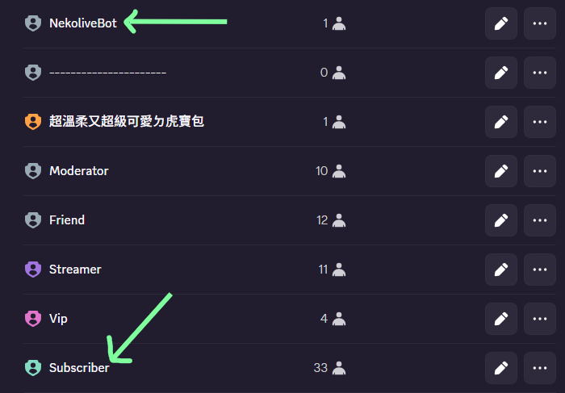

# NekoliveBot 管理員手冊

**[點我邀請 NekoliveBot 加入您的群組](https://discord.com/oauth2/authorize?client_id=1083697241711181864){:target="_blank"}**

NekoliveBot 是創作者斗內平台提供的 Discord 群組管理機器人，目前有提供洗版偵測、誘餌頻道（抓洗版機器人）、可疑帳號偵測、全域黑名單、使用者檢舉、機器人身分客製化等功能。

這份文件是寫給**伺服器管理員（需要權限：`管理伺服器`）**看的操作手冊：每個指令怎麼用、預設值是什麼、什麼情況下會私訊通知、遇到問題要怎麼排查。

## 從這裡開始

* 第一次設定機器人，或想知道加入伺服器後會發生什麼事 → [新手上路](#_3)
* 想調整某個功能 → [群組功能開關](commands/settings.md)
* 機器人踢不動人、私訊收不到 → [常見問題與疑難排解](faq.md)

## 快速開始

邀請時請確認機器人被授予了下列權限，之後大部分功能才能正常運作：檢視頻道、發送訊息、管理訊息、管理 Webhook、加上反應、讀取訊息紀錄、變更暱稱、踢出成員、封鎖成員、逾時（禁言）成員。

如果不確定目前的權限夠不夠，可以在機器人加入後執行 `/honeypot check`（見[誘餌頻道](commands/honeypot.md)），它會列出目前實際擁有哪些權限。

## 新手上路

感謝邀請機器人，現在開始機器人就會替代管理員，24/7 管理群組！

!!! warning "隱私設定檢查"
    Discord 的隱私設定裡有沒有開啟「允許來自伺服器成員的私訊」（伺服器名稱旁的下拉選單 → 隱私設定 → 私人訊息）？

    這個設定很重要，因為機器人幾乎所有通知都是私訊擁有者：洗版警告、黑名單提醒（含處理按鈕）、誘餌頻道通知、可疑帳號偵測通知等等。

    隱私設定關著的話，Discord 會直接擋掉私訊，而且**機器人不會顯示任何錯誤**。這些通知會被整個略過，您會完全不會知道發生了什麼事。

    但要注意，踢出、禁言、封鎖等處理動作本身還是會照設定正常執行，只是不會有人被告知發生了什麼事。

機器人一加入伺服器，就會先私訊**伺服器擁有者**一次，內容是完整指令列表與使用提醒。

如果機器人是很久以前就加入的，或是您錯過了那則私訊、私訊當時是關閉的，隨時可以用幫助指令 `/help` 重新查看完整的指令列表與提醒。

任何成員都能用幫助指令，不限管理員。

## 權限與身分組位階（幾乎每個功能都要懂這個）

Discord 有一條跟權限開關無關的規則：
> **機器人只能對「身分組位階低於自己」的成員執行踢出、禁言、封鎖**。

就算你給了機器人「踢出、核准和拒絕成員」、「對成員停權」及「禁言成員」等權限，只要機器人的身分組在 **伺服器設定 → 身分組** {==清單裡排得比某個對象低==}，動作對那個對象一律會失敗。

!!! note "伺服器擁有者永遠踢不掉"
    伺服器擁有者不可能被任何人（包含機器人）踢出、禁言、封鎖，這是 Discord 本身的規則，不是機器人的判斷邏輯或誤判。

設定完任何會踢人、封鎖人的功能（誘餌頻道、可疑帳號偵測、洗版偵測、黑名單自動處理）之後，建議先執行 `/honeypot check` 檢查機器人權限。

> 這個指令雖然掛在 `/honeypot` 底下，但檢查的是機器人整體的踢出、禁言、封鎖、刪訊息能力與身分組位階，不是只給誘餌頻道用。  
> 它會告訴你機器人目前有沒有需要的權限、機器人身分組排在第幾順位、以及有哪些身分組還在機器人之上。  

/// caption
如圖範例：機器人的身分組為「NekoliveBot」，普通使用者的身分組為「Subscriber」。
///

!!! tip "權限不夠怎麼辦"
    如果檢查發現權限不夠，檢查指令的回覆下面會有一顆「🔄 重新邀請機器人」按鈕，點下去會重新走一次 Discord 應用程式加入伺服器的流程，完成後會直接補齊機器人所有需要的權限，這樣就可以不用把機器人踢掉重邀一次。  
    {==但身分組位階這件事按鈕解決不了，還是要自己去 **伺服器設定 → 身分組** 把機器人的身分組拖到比較高的位置。==}

## 指令一覽

| 指令 | 用途 |
|---|---|
| `/settings` | 查看／切換各項功能的啟用狀態 |
| `/antispam` | 洗版偵測與處理設定 |
| `/honeypot` | 誘餌頻道，抓洗版機器人 |
| `/accountcheck` | 可疑帳號（疑似機器人）偵測 |
| `/mentionguard` | 大量標記（@everyone／@here、大量身分組或成員）偵測 |
| `/blacklist` | 全域黑名單查詢與處理設定 |
| `/backup` | 伺服器結構備份與還原 |
| `/identity` | 機器人在此群組顯示的暱稱／大頭貼 |
| `/report` | 檢舉使用者（任何成員都能用） |
| `/roleid` | 查詢身分組編號 |
| `/webhook` | 建立通知用 Webhook |
| `/help` | 隨時查看這份指令列表（任何成員都能用） |

除了 `/report` 跟 `/help` 以外，其他指令都需要「管理伺服器」權限才能使用；`/backup` 因為會直接動到伺服器結構，需要「管理員」權限。
